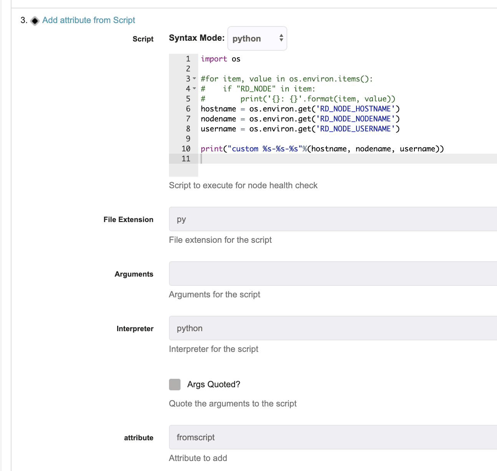

# Rundeck Node Enhancer Script Plugin

Add an attribute for a node with the output of a script.

## Install

* build or download the release artifact

```
gradle clean build
```

* copy jar file to `$RDECK_BASE/libext` folder

## Configuration

* **Script**: Script to execute that will get the new attribute value
* **File Extension**: File extension for the script
* **Arguments**: Arguments for the script
* **Interpreter**: Interpreter for the script
* **attribute**: Attribute name that will be added to the node

## How to use

* Add inline script 
* existing node attributes can be capture on the script as a environment variables ( `RD_NODE_XXXX` ). For example using python:

```
hostname = os.environ.get('RD_NODE_HOSTNAME')
nodename = os.environ.get('RD_NODE_NODENAME')
username = os.environ.get('RD_NODE_USERNAME')

```

* on the inline script, print or echo the string that you want to add to the node




## TODO
* merge multiples attributes (based on an array format, eg: json, yaml)
